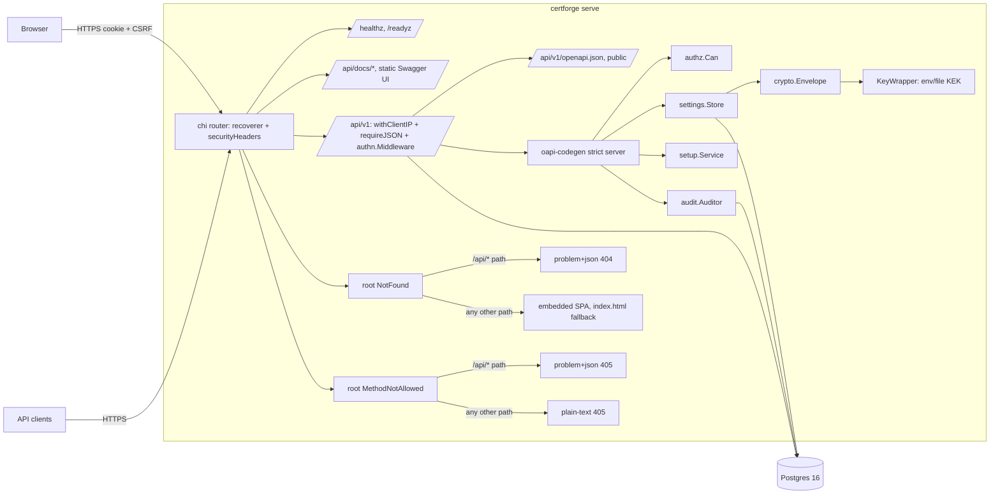
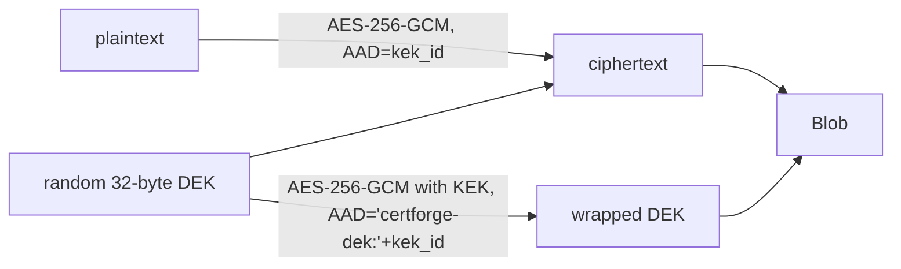
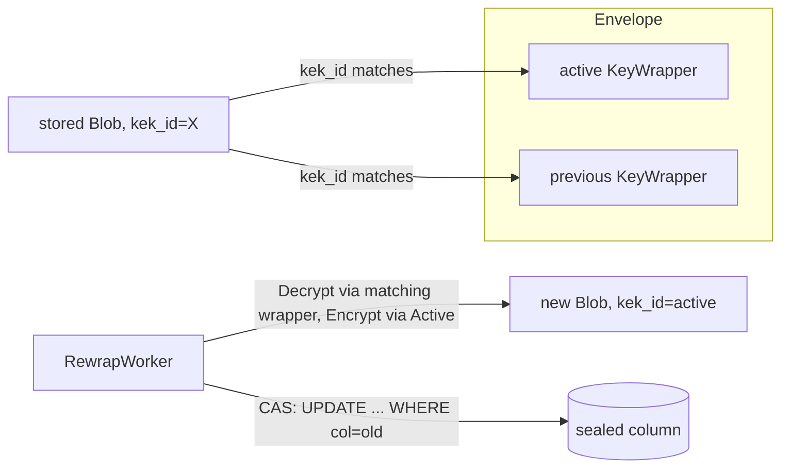
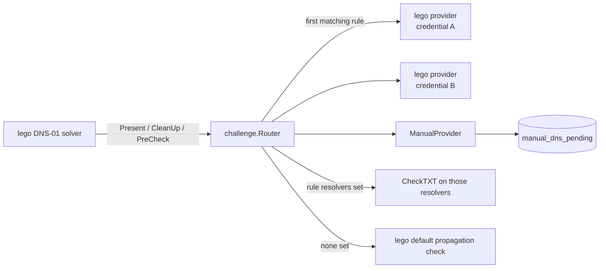
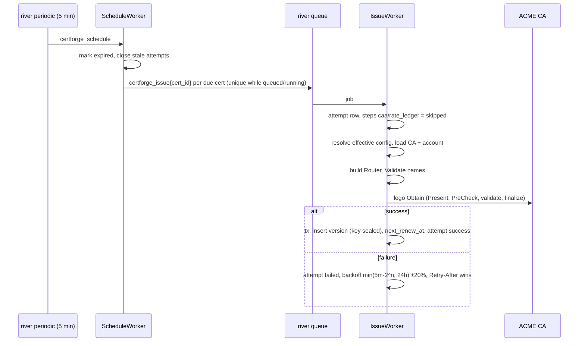
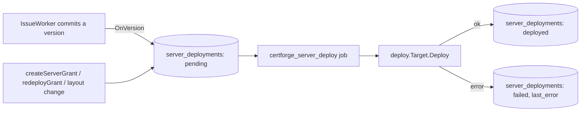
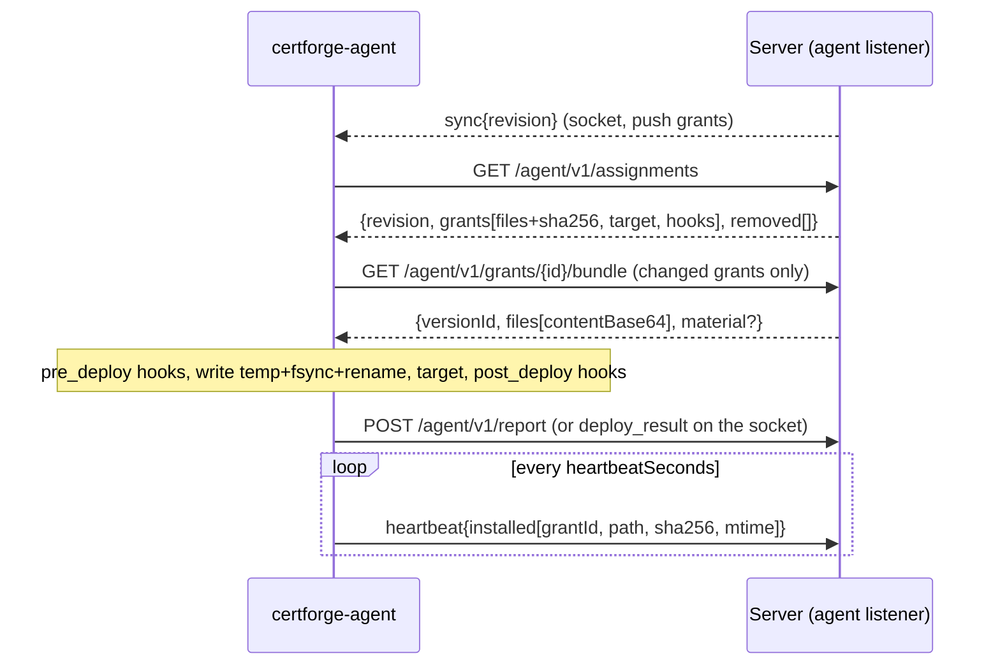
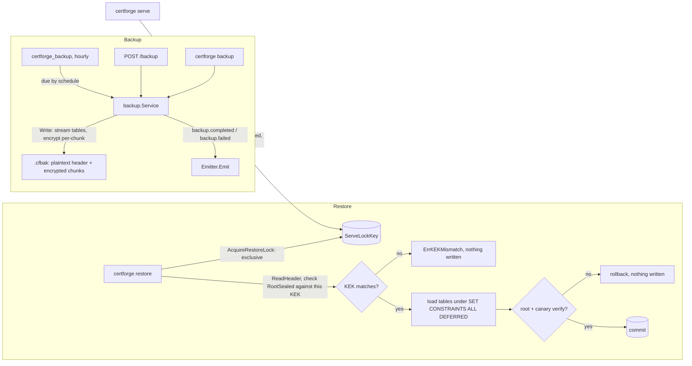

# Architecture

## Components (Phase 1A)



| Package | Role |
|---|---|
| `internal/config` | Reads the only env vars: DB URL, KEK, listeners, base URL, log level |
| `internal/db` | pgx pool, embedded goose migrations (Postgres session-locked, safe to run repeatedly and from several processes), sqlc queries |
| `internal/crypto` | Envelope encryption, `KeyWrapper` |
| `internal/settings` | Settings table: JSON values, sealed secrets, JSON-Schema sections, KEK canary |
| `internal/authn` | argon2id local admin, Postgres sessions, CSRF, `Principal` in context |
| `internal/authz` | Roles → actions, org-scoped bindings, `Can()` |
| `internal/audit` | Append-only, SHA-256 hash-chained events |
| `internal/meta` | Registry of pluggable type schemas for `GET /api/v1/meta/schemas` |
| `internal/setup` | First-run wizard, bootstrap-admin |
| `internal/api` | Router, handlers, problem+json, generated server in `gen/` |
| `internal/webui` | Embedded SPA with index.html fallback (placeholder page unless built with `-tags embedweb`) |

`deploy/compose.yaml` publishes the agent mTLS port (`${CF_AGENT_PORT:-8443}:8443`) alongside the HTTP port, but nothing listens on `:8443` yet; the agent listener is Phase 3 work.

## Startup

1. `config.Load` validates env; a bad KEK length or missing DB URL exits.
2. `db.Open` pings Postgres; `db.Migrate` applies pending migrations under a Postgres session lock.
3. `settings.EnsureCanary` writes the `crypto.canary` secret on first boot, or decrypts it. On failure the server still starts, logs the error, and `/readyz` returns 503.
4. The router is built and serves on `CF_LISTEN_HTTP`. An hourly goroutine purges expired sessions.

## Request path

At the router root, `recoverer` (a local replacement for chi's `middleware.Recoverer`, so a panic becomes a `problem+json` 500 with a logged stack instead of a bare 500) and `securityHeaders` wrap everything, including `/healthz`, `/readyz`, and `/api/docs/*`. Under `/api/v1`: `withClientIP` → `requireJSON` (415 for non-JSON bodies on POST/PUT/PATCH) → `authn.Middleware` (session cookie → `Principal`, CSRF check on mutating methods, 401 unless the route is in `isPublic`) → the oapi-codegen strict handler → `authorize()` (`authz.Can`) → store or service → `audit.Record`.

Root-level `NotFound` and `MethodNotAllowed` handlers both branch on path prefix, but only `NotFound` falls through to the web UI: for a path under `/api/`, `NotFound` returns `problem+json` 404 and `MethodNotAllowed` returns `problem+json` 405; for any other path, `NotFound` falls through to the embedded SPA handler (`webui.Handler()`), which serves `index.html` so client-side routes resolve, while `MethodNotAllowed` returns a plain-text 405 (`http.Error`), not the SPA. Within `/api/v1`, unmatched paths and methods also return `problem+json`. Handler errors of type `*api.HTTPError` become `problem+json`; any other error is logged and then also written as a `problem+json` 500 (`Write(w, 500, "Internal server error", "")`), not a bare 500.

`authn.LoadPrincipal` builds `Principal.Roles`/`Bindings`/`OrgIDs` from `role_bindings`; a binding with a non-NULL `site_id` is skipped entirely until site scope is modelled in Phase 2, so it currently grants nothing. Login (`POST /api/v1/auth/login`) and setup completion (`POST /api/v1/setup/complete`) both build the full principal (via `finishSession`) before `startSession` sets the `cf_session` cookie; if anything after session creation fails, the session row is deleted best-effort so a failed login never leaves a live cookie or session behind.

## Envelope encryption



Blob bytes: `0x01 | len(kek_id) | kek_id | u16 len(wrapped) | wrapped | len(nonce) | nonce | ciphertext`. `kek_id` (`crypto.KeyID`) is `static-` plus 16 hex characters of a domain-separated hash, `SHA-256("certforge-kek-id:" || key)`, not a plain SHA-256 of the key, so a different KEK is detected before any decryption. `Decrypt` validates every length and never panics on malformed input. Phase 5 adds a Vault Transit `KeyWrapper` (`crypto.TransitWrapper`, `kek_id` = `vault-` plus 16 hex characters derived from the Vault address, mount and key name — stable across a Transit key-version bump inside Vault).

### Multi-wrapper envelope and KEK rotation (Phase 5, ADR 0014)

`crypto.Envelope` holds one active `KeyWrapper` plus zero or more previous ones (`CF_KEK_PREVIOUS[_FILE]`, `CF_KEK_PREVIOUS_VAULT_*`). `Encrypt` always uses the active wrapper; `Decrypt` picks whichever wrapper's id matches the blob's own `kek_id` header, so a row sealed under a previous KEK keeps decrypting for as long as that KEK stays configured — no downtime, no offline migration, while `internal/kek.RewrapWorker` moves rows onto the active KEK in the background.



A previous→active rewrap always decrypts and re-encrypts the whole value through the Envelope (fresh DEK, nonce and ciphertext), never just re-wraps the DEK in place: `Encrypt`'s AEAD binds `kek_id` as additional data, so relabelling it onto old ciphertext would break authentication on the next read. The one exception is a same-id Transit key-version bump on the active KEK (`TransitWrapper.Rewrap`, the `crypto.Rewrapper` interface), which moves the wrapped DEK alone without the DEK ever leaving Vault. Every rewrap write is `UPDATE ... SET col = $new WHERE pk = $pk AND col = $old` — a lost compare-and-swap counts the row in `remaining` for the next run rather than overwriting data the job never decrypted. See `docs/operations.md#kek-rotation` and `#rewrap` for the operator-facing runbook.

## Data model (Phase 1A)

`orgs`, `sites` (org-scoped), `users` (at most one with `local_password_hash`, enforced by a partial unique index), `sessions` (id = SHA-256 of the cookie token, per-session CSRF), `role_bindings` (subject, role, optional org and site; the `role` check constraint is `admin`, `org-admin`, `operator`, `viewer`, `auditor`), `settings` (key, jsonb value, sealed bytea secret), `audit_events` (append-only via triggers that block UPDATE/DELETE/TRUNCATE, `prev_hash` unique).

## Setup and bootstrap

`setup.Service.Complete` short-circuits (`ErrAlreadyComplete`) as soon as `NeedsSetup` reports false, before hashing a password or taking the advisory lock, then re-checks under the lock so a concurrent completer cannot race past the short-circuit. It validates `baseUrl` twice: `config.ValidateBaseURL` for a well-formed absolute http(s) URL, then against the `general` settings section's JSON Schema (the same schema `PUT /api/v1/settings/general` enforces), so setup never accepts a `baseUrl` a later unchanged `PUT` of that section would reject.

`cmd/certforge bootstrap-admin` reads `CF_ADMIN_PASSWORD` as one-shot CLI input (or `--password-stdin`) to reset (after setup) the local admin's password and revoke its sessions; it is not server configuration and `serve` never reads that variable.

## Extension points

- New API operation: `api/openapi.yaml` → `make generate` → method on `*api.Server`.
- New settings section: `sections.MustRegister(name, schema, default)` in `cmd/certforge/serve.go`.
- New pluggable type: `metaReg.Add(meta.Kind..., meta.Entry{...})` in `serve.go`.

## Routing challenge provider

`challenge.Router` is built per attempt from the certificate's verification rules followed by the inherited catch-all rules (certificate overrides, then org, then global defaults). See [ADR 0005](adr/0005-routing-challenge-provider.md).



A mixed-method certificate (its names resolve to more than one challenge type) does not register with lego's `SolverManager` at all:

```mermaid
flowchart LR
  O[mixedResolver.Solve] -->|per authorization: TypeFor + FindChallenge| Pick[pickChallenge]
  Pick -->|dns-01| RD[Router.For&#40;dns-01&#41;]
  Pick -->|http-01| RH[Router.For&#40;http-01&#41;]
  Pick -->|tls-alpn-01| RT[Router.For&#40;tls-alpn-01&#41;]
  RD --> DC[dns01.NewChallenge]
  RH --> HC[http01.NewChallenge]
  RT --> TC[tlsalpn01.NewChallenge]
  DC & HC & TC -->|validate: hand-rolled poll| CA[(ACME CA)]
```



- Match patterns: `*`, `*.zone` (one label below zone, or `*.zone` itself), `zone` (zone and everything below). First match wins. The UI's coverage panel uses the same rules.
- `Router.Validate` rejects uncovered names and IP addresses before an order exists. `ruleFor` — the single choke point every name-to-rule lookup goes through — skips an http-01/tls-alpn-01 rule for a wildcard name and tries the next matching rule in order (no ACME CA offers those challenges for a wildcard authorization), so such a name is "uncovered" only once every rule in its path has been skipped this way.
- lego providers are built by `challenge.Build` under a global mutex with an isolated environment (`internal/challenge/lego_env.go`).
- Provider schemas are generated from lego's TOML metadata by `tools/gen-lego-schemas` into `internal/challenge/schemas/` and published to the meta registry by `challenge.AddToMeta` and served under `dnsProviders` in `GET /api/v1/meta/schemas`.

### Type-aware routing (Phase 4A)

A rule's challenge type comes from its provider's `Type()` (manual-dns counts as dns-01, since both use the TXT record). `Router.For(t)` returns a view scoped to one type: its `Present`/`CleanUp`/`PreCheck` resolve a lego callback's bare authorization domain to the rule of type `t` that covers it (`routeForType`), rather than to whichever rule the domain would otherwise resolve to. This matters because lego's `SolverManager.chooseSolver` picks a registered solver per authorization by a fixed type preference, never by domain — with two providers registered (say dns-01 and http-01) every authorization of an order would otherwise reach the same one, regardless of which rule actually names it. `acme.Signer.Issue` registers exactly one type's view (`solver.For(type)`) as the matching lego provider (`SetDNS01Provider`, `SetHTTP01Provider`, `SetTLSALPN01Provider`) when `req.Challenge.ChallengeTypes()` names only one type. A certificate whose rules span more than one type goes through `issueMixed` instead (`internal/signer/acme/orderflow.go`, [ADR 0012](adr/0012-mixed-method-order-flow.md)): it builds the ACME core directly with the exported `api.New` (`lego.Client`'s own core is unexported) and drives `certificate.NewCertifier` with a `mixedResolver` that resolves each authorization's type from `solver.TypeFor` and its own `solver.For(t)` view, so one order can mix dns-01, http-01 and tls-alpn-01 across a certificate's names.

http-01 rules with `via: server` (the default) are served by this process itself: `challenge.HTTPTokens` holds each pending token's key authorization in memory (10-minute TTL) for `GET /.well-known/acme-challenge/{token}` on the main listener (see [docs/api.md](api.md)) to answer. `via: agent` and every tls-alpn-01 rule are served by a client over its agent connection: `agents.Service` implements `challenge.AgentRelay` (`issueWorker.Relay`, wired in `cmd/certforge/serve.go`) and relays `Present`/`CleanUp` through it (`challenge_present`/`challenge_cleanup`, Task 7), waiting up to `agents.DefaultChallengeReadyTimeout` (30s) for the client's `challenge_ready`. A client that is offline or reports no matching capability fails the attempt with "client `<name>` is offline or cannot serve challenges"; one that never answers in time fails with "client `<name>` did not confirm the challenge within 30s".

## Issuance flow



- `POST /certificates` and `POST /certificates/{id}/renew` enqueue the same job directly.
- Attempt steps: `caa`, `rate_ledger` (skipped until Phase 4), `account`, `order`, `challenge <name>` (one per name; `waiting_manual` while an operator must act), `finalize`, `store`.
- ACME and challenge failures are recorded and scheduled through `certificates.next_renew_at`; the job itself succeeds. Only database errors make river retry the job.
- `next_renew_at` after success: `days` mode is `notAfter − N days`, `percent` mode is `notAfter − N% of lifetime`, never earlier than half the lifetime. ARI (`useAri`) is stored and ignored until Phase 4.
- A failed renewal keeps a still-valid certificate `active`; the periodic scan marks certificates `expired` when the current version's `notAfter` passes.

## Grants and revisions

```mermaid
flowchart LR
  V[IssueWorker commits a version] -->|OnVersion| R[agents.render]
  G[Grant, layout, target or hook change] --> R
  R -->|same tx| D[(deployments.expected, state pending)]
  R -->|same tx| B[(clients.desired_revision + 1)]
  B -->|after commit, push grants| S[hub: sync{revision}]
```

A grant is a client × certificate assignment with a layout and/or a deploy target, a run-ordered list of hooks and a delivery mode (`push` or `pull`); `deployments.expected` holds the digests the server rendered for the grant's certificate's current version, and `deployments.installed`/`state` hold what the agent last reported. Every grant create, update, redeploy or delete, every layout, deploy target or hook change, and every new certificate version re-renders the affected grants' `deployments.expected` and bumps `clients.desired_revision` inside the same transaction as the change; a `sync{revision}` nudge is sent over the hub after commit, but only to clients that have a push grant among the changed ones — pull grants wait for the agent's own pull schedule, so a change touching only pull grants never nudges.

A new certificate version is rendered by `agents.Service.OnVersion` (the `issuance.VersionListener`) in its own transaction after the issuance commit, not the issuance transaction itself; a failed or lost `OnVersion` (for example the process stopping between commit and the listener call) is caught by an hourly river job, `SweepDeployments`, that re-renders every live grant whose deployment is behind its certificate's current version. Both re-render one client per transaction, so a render failure for one client (a corrupted deploy target config, say) is logged and does not block or roll back any other client's update. `render` always locks every affected client `FOR UPDATE` before it writes a deployment row, in every caller, so a grant write (which already holds its one client's lock) and a resync (layout/target/hook change, a new version, the sweep, or a certificate rename) can never take the two locks in opposite orders. Renaming a certificate re-renders and path-checks its live grants in the same transaction as the rename, since a Traefik target's paths depend on `SafeName(certificate name)`.

Two grants on one client may never write the same path — including a Traefik target's generated `certs/<SafeName>/*` files, so two certificates whose names share a `SafeName` collide — checked across the client's live grants and any still awaiting removal (their last-rendered `expected` paths count, falling back to their layout/target definition when nothing was ever rendered); a conflicting create, update, layout/target update or certificate rename returns 409. Deleting a grant of a client that has ever actually applied a revision marks it `removed_at` and bumps the revision so the agent can delete its files on its own schedule; the row is only deleted once the agent's next report confirms the files are gone. A grant of a client that is revoked, or is pending and has never applied any revision (no agent ever could have written its files), has no agent to act on it, so the delete removes the row at once — including a client that re-enrolled after deploying, which keeps the soft-delete path since files from before the re-enrolment may still be on disk. Deleting a certificate locks it and counts its live and removal-pending grants (not just live ones, since `cert_id` cascades) in one transaction; creating a grant locks the certificate in a compatible-but-exclusive mode, so the two can never race each other into a dangling grant.

### Server-side deploy {#server-side-deploy}

A server-run deploy target (`vault-kv`; `internal/deploy.RunsOn`) has no agent, so its grants ("server grants": `client_cert_grants.client_id NULL`, `deploy_target_id` set) never enter the flow above — `agents.render`, `OnVersion` and `SweepDeployments` all exclude them (`client_id IS NOT NULL`), and a grant's `Grant.runsOn`/`Grant.serverDeployment` in place of `deployment` tells the two kinds apart in the API. `internal/deploy.Dispatcher` is their own, parallel `issuance.VersionListener`, registered in `cmd/certforge/serve.go` alongside `agents.Service`:



`Dispatcher.OnVersion` upserts every live server grant of the certificate to `pending` and enqueues `certforge_server_deploy{grantId, versionId}` (unique per grant while queued or running, so a burst of versions never stacks duplicate jobs; retried up to 5 times with backoff on failure). `createServerGrant`, `redeployGrant` and a server grant's own `updateGrant` (layout change) call the same upsert-and-enqueue (`Dispatcher.EnqueueTx`) from their own transaction, so the grant write and the first deploy attempt commit together. `DeployWorker` renders the certificate's own material — a layout's files (PEM parts only; a server grant's layout may never hold a p12/jks/DER file) or, without one, the four canonical PEM parts (the key only when the target's `includeKey` is set) — and hands them to the target's own `Deploy`. A failure records a truncated (≤ 1000 characters) `last_error`; every `internal/vault.Client` error a `Target` implementation returns is already redacted of any token or secretId before `Dispatcher` ever sees it, so `last_error` is safe to show as-is. Deleting a server grant removes its row (and, by cascade, its `server_deployments` row) at once — there is no agent to wait on, so there is no removal-pending state the way a client grant has.

### Deploy targets {#deploy-targets}

`internal/targets` (Phase 7A) is the shared, database-free model every deploy target type will implement, one `Registry` keyed by type code in place of the separate `internal/deploy`/`internal/delivery` switches above (a later task moves `vault-kv` and Traefik onto it). Each type declares a `Mode` — `server`, `agent`, or `either`, when the operator chooses at create time (`ResolveSide`) — telling a grant whether it needs a client or runs server-side the way `vault-kv` does today, and a `KeyPolicy` (`never`/`optional`/`always`) telling the API whether it needs the certificate's private key. A `FileTarget` (Traefik's file-provider target, and any future one) renders the files an agent writes rather than making a live call of its own; an optional `Reloader` signals a service reload afterward. A type's config schema marks its write-only fields `"secret": true`; `Registry.Parse` merges a request's secret fields against the ones already stored for it — an omitted field or the `__unchanged__` sentinel keeps the stored value (and is reported back, so a caller can skip re-encrypting it), an explicit `""` clears it — before handing the fully resolved config to the type's own `Parse`, which enforces which of its secrets are actually required; `Split`/`Merge` move a config's secret fields out of and back into its public JSON. `Redact` scrubs a target's own secrets — raw, URL-escaped and base64 forms — out of any error before it can reach `last_error`, a `deploy.failed` event or a log line. `internal/targets/targetstest` provides test-only types (`Secret`, `File`) that exercise this shape without a product registry ever seeing them.

## Agent protocol

The agent listener (`CF_LISTEN_AGENT`, mutual TLS against the internal agent CA — ADR 0009) serves `/agent/v1/*`, a small `net/http` surface separate from the OpenAPI-documented `/api/v1/*`. Every route but `/agent/v1/enroll` runs behind `requireAgent`, which admits only a client certificate the agent CA store still trusts, mapped by its embedded client id to an `active` client whose serial matches the newest one issued to it.

Endpoints:
- `POST /agent/v1/enroll` — consumes a one-time token and a CSR, returns a signed agent certificate, the trust bundle and the agent URL.
- `POST /agent/v1/renew` — a certificate for an authenticated agent, near expiry or replaced.
- `GET /agent/v1/assignments` — the client's current grants and pending removals, keyed to `clients.desired_revision`.
- `GET /agent/v1/grants/{id}/bundle` — the one grant's rendered files (and, for a deploy target, key material), audited as `grant.bundle_fetched`.
- `POST /agent/v1/report` — deployment outcomes, hook runs and removal confirmations for one revision.
- `POST /agent/v1/heartbeat` — installed-file digests, re-checked against drift between reports.
- `GET /agent/v1/ws` — the WebSocket session an agent holds while connected (push `sync` nudges; see Socket below).

`agentproto.Assignments` (the `GET /agent/v1/assignments` body):
```
{revision, grants: [{id, certificateId, certificateName, versionId, fingerprint, delivery, files: [{path, owner, group, mode, sha256}], target: {type, config}|null, hooks: [{id, phase, argv, timeoutSeconds}]}], removed: [{id, files: [path...], target}]}
```
A grant appears in `grants` once its certificate has an issued version; a grant marked `removed_at` appears in `removed` instead, listing the paths it last wrote so the agent knows what to delete. Only a removal result deletes the row: `state: ok` with no `versionId` (a deploy result always names one), in a report whose `revision` is at or past the one that first listed the grant under `removed` (`client_cert_grants.removed_revision`). A deploy result computed from assignments fetched before the operator deleted the grant therefore never confirms a removal it never saw, and the grant stays in `removed` until the agent has actually taken the files off the host.

`agentproto.Report` (the `POST /agent/v1/report` body, also the WebSocket `deploy_result` message):
```
{revision, results: [{grantId, versionId, state, installed: [{path, sha256}], error, hookRuns: [{hookId, phase, argv, exitCode, durationMs, stdout, stderr}]}]}
```
A result for a grant the client does not hold is ignored, and one whose `versionId` is not the deployment's current one changes no deployment state — a late or foreign report changes nothing — but its `hookRuns` are still recorded (they ran on the host either way), with `hookId` kept only when it names one of that grant's own hooks in the client's org and stored as null otherwise. `Report` and `Heartbeat` both lock the client row (`LockClientByID`) before locking its deployment rows (`ClientDeployments ... FOR UPDATE OF d`), the same client-then-deployment order every grant-writing path in this service uses. `clients.applied_revision` only ever advances, capped at `desired_revision`, so a report for a revision older than the last one applied cannot move it backwards.

Drift: a deployment's state is `pending` until the first report, then `ok` or `drift`/`failed` from comparing `deployments.expected` (what the server rendered) against what the agent says it installed — a report's own `installed` digests, or a heartbeat's. `HeartbeatState` only re-checks a deployment already `ok` or `drift`; `pending` and `failed` deployments wait for a report instead. Every state transition is audited exactly once, as `deployment.ok`/`deployment.failed`/`deployment.drift`, not on every report or heartbeat that merely repeats the current state. A grant with `auto_remediate` set bumps `clients.desired_revision` (and nudges over the hub for a push grant) the moment its deployment turns `drift`, so the agent redeploys on its own without an operator's redeploy.



## Event fan-out and notifications (Phase 6A)

Every R2 event source shares one `*notify.Emitter` and one `*notify.Registry`, both constructed once in `cmd/certforge/serve.go` and handed to `notify.Service` (channel CRUD, `testChannel`, `listEvents`), `notify.Sources` (`cert.issued`/`cert.renewal_failed` synchronously, the rest hourly), `monitor.Service` and `backup.Service`:

```mermaid
flowchart LR
  subgraph Sources
    IW[IssueWorker.Listeners] -->|OnVersion: cert.issued| NS[notify.Sources]
    IW -->|OnFailure: cert.renewal_failed| NS
    Scan[certforge_notify_scan, hourly] -->|expiring/expired, deploy, offline, agent-cert, prune| NS
    Mon[monitor.Service.Check] -->|state transition| MonEv[monitor.mismatch/unreachable/expiring/recovered]
    Bak[backup.Service.RunScheduled] -->|backup.completed/failed| BakEv[backup event]
    API[testChannel] -->|test| TestEv[test event]
  end
  NS --> E[Emitter.Emit]
  MonEv --> E
  BakEv --> E
  TestEv --> E
  E -->|exact-once by DedupeKey, tx| Events[(notification_events)]
  E -->|FOR KEY SHARE, per matching enabled channel| Deliv[(notification_deliveries: pending)]
  E -->|InsertTx| Job[certforge_notify_deliver]
  Job --> DW[DeliverWorker]
  DW -->|Registry.Get&#40;channel.type&#41;| N[Notifier.Send]
  N -->|webhook/discord/ntfy/homeassistant| HX[httpx.Client: no redirects, SSRF-checked]
  N -->|smtp| Mail[mail.SendMail]
  DW -->|redacted last_error| Deliv
```



`Emit` locks the event's matching channels `FOR KEY SHARE` and writes the event plus one `notification_deliveries` row per match inside one transaction (a nil `tx` argument opens its own), so a delivery job is only ever enqueued for a channel the same commit already recorded as pending — there is no window where a job exists with no row to update. `DedupeKey` (its exact per-kind shape is in `docs/notifications.md#dedupe`) makes `Emit` a no-op for a condition already recorded; `notify.Sources.Scan` (the hourly `certforge_notify_scan` job) also prunes `notification_events` older than `notify.EventRetention` (90 days) in the same run, since the dedupe key itself only exists for as long as its row does.

`DeliverWorker` looks the channel's notifier up in the shared `Registry` by `type`, decrypts the channel's sealed secrets, and calls `Notifier.Send`; a failure's error is passed through `httpx.Redact` against every secret value before it is ever written to `last_error` (`docs/security.md#notification-channel-secrets-and-url-policy`). `monitor.Service` and `backup.Service` hold the same `*notify.Emitter` pointer `notify.Sources` does — set once, after `riverClient` exists (`notifyEmitter.River = riverClient`), since `Emitter.River` is only needed at `Emit` time, never at `RegisterRiver` time.

## Backup and restore (Phase 6A)



The stream key (`DeriveKey(DeriveKey(root, "certforge-backup"), hex(salt))`) and the archive format itself are `docs/security.md#backup-encryption` and `docs/operations.md#backup`; this diagram is the wiring only. `serve.go` derives `backupBaseKey` once at boot, before `clear(root)`, and passes it to `backup.Service` alongside the KEK id(s) that `Write` seals `RootSealed` with on each run — `Write` itself re-reads the live `crypto.root` row inside its own snapshot transaction, so a backup taken after a KEK rewrap never uses a stale key. `AcquireServeLock`/`AcquireRestoreLock` share one advisory lock key (`backup.ServeLockKey`): any number of `serve` processes hold it shared for their whole lifetime, a `restore` needs it exclusively, so a running server always blocks a restore and a restore in progress blocks a server from starting (`docs/security.md#serve-lock-and-restore`).

### Socket

`internal/agenthub` keeps one WebSocket per client (ADR 0010): the newest connection for a client evicts the old one, the server pings every 25 s and closes a socket after 75 s without a message or pong, and the registry is in-memory and single-replica — `Client.connected` means connected to this process. Messages: server-sent `hello_ack` (reply to `hello`, carries the heartbeat interval and desired revision), `sync{revision}` (a nudge; the agent still fetches full assignments), `trust_bundle_update` (after a CA rotation), `revoked` (immediately followed by a close), `challenge_present{token, keyAuth, domain, method, webroot?}` and `challenge_cleanup{token}` (an http-01/tls-alpn-01 rule served by this client's agent; see [agent.md#challenge-serving](agent.md#challenge-serving)); agent-sent `hello`, `heartbeat`, `deploy_result` (a `Report`) and `challenge_ready{token, error?}` (the reply to `challenge_present`), handled by the same `agents.Service` methods the REST endpoints use (`challenge_ready` has no REST equivalent: it only ever arrives over the socket). Close codes: `4000` replaced by a newer connection, `4001` revoked or re-enrolled, `4002` idle timeout.
