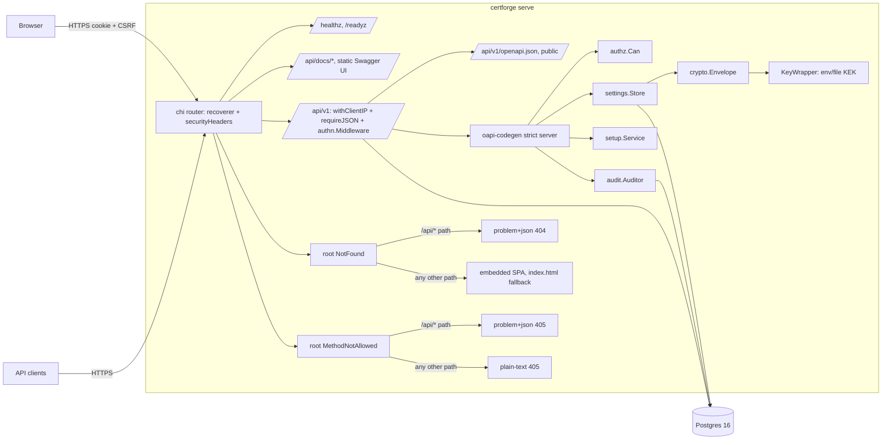
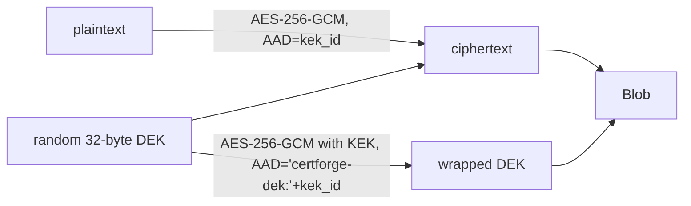
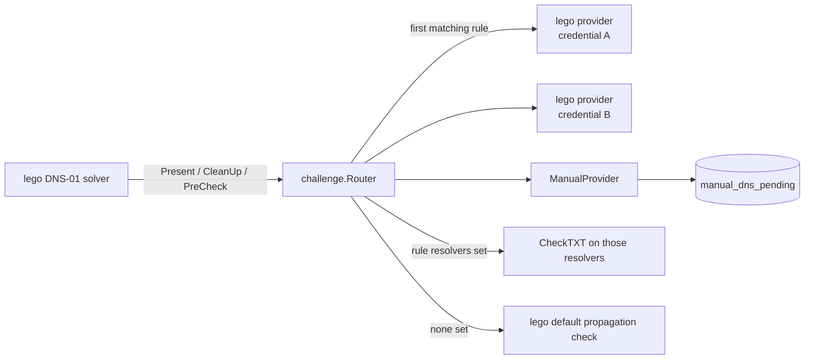
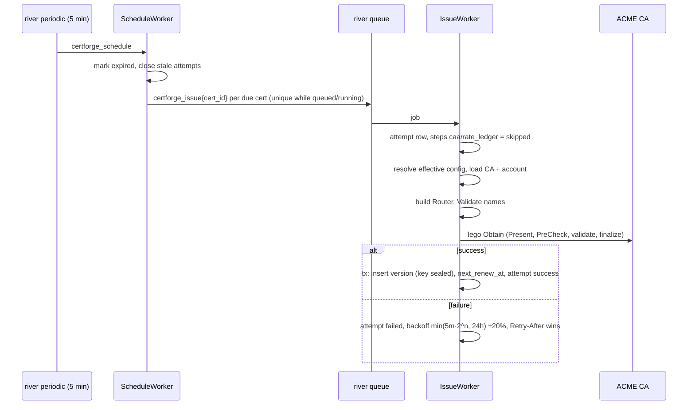
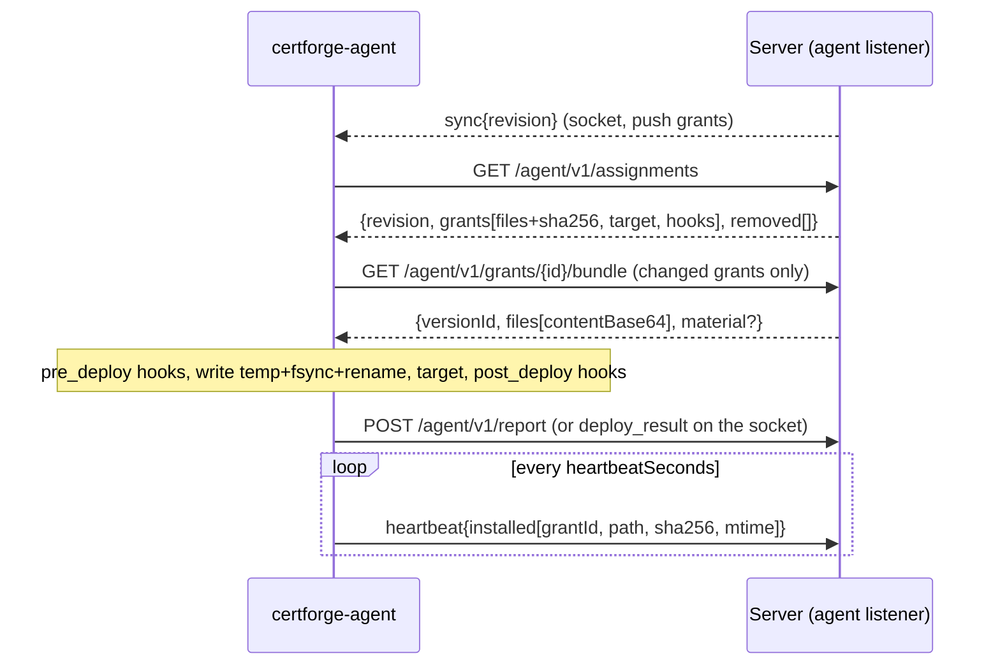

# Architecture

## Components (Phase 1A)



| Package | Role |
|---|---|
| `internal/config` | Reads the only env vars: DB URL, KEK, listeners, base URL, log level |
| `internal/db` | pgx pool, embedded goose migrations (Postgres session-locked, safe to run repeatedly and from several processes), sqlc queries |
| `internal/crypto` | Envelope encryption, `KeyWrapper` |
| `internal/settings` | Settings table: JSON values, sealed secrets, JSON-Schema sections, KEK canary |
| `internal/authn` | argon2id local admin, Postgres sessions, CSRF, `Principal` in context |
| `internal/authz` | Roles → actions, org-scoped bindings, `Can()` |
| `internal/audit` | Append-only, SHA-256 hash-chained events |
| `internal/meta` | Registry of pluggable type schemas for `GET /api/v1/meta/schemas` |
| `internal/setup` | First-run wizard, bootstrap-admin |
| `internal/api` | Router, handlers, problem+json, generated server in `gen/` |
| `internal/webui` | Embedded SPA with index.html fallback (placeholder page unless built with `-tags embedweb`) |

`deploy/compose.yaml` publishes the agent mTLS port (`${CF_AGENT_PORT:-8443}:8443`) alongside the HTTP port, but nothing listens on `:8443` yet; the agent listener is Phase 3 work.

## Startup

1. `config.Load` validates env; a bad KEK length or missing DB URL exits.
2. `db.Open` pings Postgres; `db.Migrate` applies pending migrations under a Postgres session lock.
3. `settings.EnsureCanary` writes the `crypto.canary` secret on first boot, or decrypts it. On failure the server still starts, logs the error, and `/readyz` returns 503.
4. The router is built and serves on `CF_LISTEN_HTTP`. An hourly goroutine purges expired sessions.

## Request path

At the router root, `recoverer` (a local replacement for chi's `middleware.Recoverer`, so a panic becomes a `problem+json` 500 with a logged stack instead of a bare 500) and `securityHeaders` wrap everything, including `/healthz`, `/readyz`, and `/api/docs/*`. Under `/api/v1`: `withClientIP` → `requireJSON` (415 for non-JSON bodies on POST/PUT/PATCH) → `authn.Middleware` (session cookie → `Principal`, CSRF check on mutating methods, 401 unless the route is in `isPublic`) → the oapi-codegen strict handler → `authorize()` (`authz.Can`) → store or service → `audit.Record`.

Root-level `NotFound` and `MethodNotAllowed` handlers both branch on path prefix, but only `NotFound` falls through to the web UI: for a path under `/api/`, `NotFound` returns `problem+json` 404 and `MethodNotAllowed` returns `problem+json` 405; for any other path, `NotFound` falls through to the embedded SPA handler (`webui.Handler()`), which serves `index.html` so client-side routes resolve, while `MethodNotAllowed` returns a plain-text 405 (`http.Error`), not the SPA. Within `/api/v1`, unmatched paths and methods also return `problem+json`. Handler errors of type `*api.HTTPError` become `problem+json`; any other error is logged and then also written as a `problem+json` 500 (`Write(w, 500, "Internal server error", "")`), not a bare 500.

`authn.LoadPrincipal` builds `Principal.Roles`/`Bindings`/`OrgIDs` from `role_bindings`; a binding with a non-NULL `site_id` is skipped entirely until site scope is modelled in Phase 2, so it currently grants nothing. Login (`POST /api/v1/auth/login`) and setup completion (`POST /api/v1/setup/complete`) both build the full principal (via `finishSession`) before `startSession` sets the `cf_session` cookie; if anything after session creation fails, the session row is deleted best-effort so a failed login never leaves a live cookie or session behind.

## Envelope encryption



Blob bytes: `0x01 | len(kek_id) | kek_id | u16 len(wrapped) | wrapped | len(nonce) | nonce | ciphertext`. `kek_id` (`crypto.KeyID`) is `static-` plus 16 hex characters of a domain-separated hash, `SHA-256("certforge-kek-id:" || key)`, not a plain SHA-256 of the key, so a different KEK is detected before any decryption. `Decrypt` validates every length and never panics on malformed input. Phase 5 adds a Vault Transit `KeyWrapper` and rewrap.

## Data model (Phase 1A)

`orgs`, `sites` (org-scoped), `users` (at most one with `local_password_hash`, enforced by a partial unique index), `sessions` (id = SHA-256 of the cookie token, per-session CSRF), `role_bindings` (subject, role, optional org and site; the `role` check constraint is `admin`, `org-admin`, `operator`, `viewer`, `auditor`), `settings` (key, jsonb value, sealed bytea secret), `audit_events` (append-only via triggers that block UPDATE/DELETE/TRUNCATE, `prev_hash` unique).

## Setup and bootstrap

`setup.Service.Complete` short-circuits (`ErrAlreadyComplete`) as soon as `NeedsSetup` reports false, before hashing a password or taking the advisory lock, then re-checks under the lock so a concurrent completer cannot race past the short-circuit. It validates `baseUrl` twice: `config.ValidateBaseURL` for a well-formed absolute http(s) URL, then against the `general` settings section's JSON Schema (the same schema `PUT /api/v1/settings/general` enforces), so setup never accepts a `baseUrl` a later unchanged `PUT` of that section would reject.

`cmd/certforge bootstrap-admin` reads `CF_ADMIN_PASSWORD` as one-shot CLI input (or `--password-stdin`) to reset (after setup) the local admin's password and revoke its sessions; it is not server configuration and `serve` never reads that variable.

## Extension points

- New API operation: `api/openapi.yaml` → `make generate` → method on `*api.Server`.
- New settings section: `sections.MustRegister(name, schema, default)` in `cmd/certforge/serve.go`.
- New pluggable type: `metaReg.Add(meta.Kind..., meta.Entry{...})` in `serve.go`.

## Routing challenge provider

lego sees one DNS-01 provider per issuance: `challenge.Router`. It is built per attempt from the certificate's verification rules followed by the inherited catch-all rules (certificate overrides, then org, then global defaults). See [ADR 0005](adr/0005-routing-challenge-provider.md).



- Match patterns: `*`, `*.zone` (one label below zone, or `*.zone` itself), `zone` (zone and everything below). First match wins. The UI's coverage panel uses the same rules.
- `Router.Validate` rejects uncovered names and IP addresses before an order exists.
- lego providers are built by `challenge.Build` under a global mutex with an isolated environment (`internal/challenge/lego_env.go`).
- Provider schemas are generated from lego's TOML metadata by `tools/gen-lego-schemas` into `internal/challenge/schemas/` and published to the meta registry by `challenge.AddToMeta` and served under `dnsProviders` in `GET /api/v1/meta/schemas`.

## Issuance flow



- `POST /certificates` and `POST /certificates/{id}/renew` enqueue the same job directly.
- Attempt steps: `caa`, `rate_ledger` (skipped until Phase 4), `account`, `order`, `challenge <name>` (one per name; `waiting_manual` while an operator must act), `finalize`, `store`.
- ACME and challenge failures are recorded and scheduled through `certificates.next_renew_at`; the job itself succeeds. Only database errors make river retry the job.
- `next_renew_at` after success: `days` mode is `notAfter − N days`, `percent` mode is `notAfter − N% of lifetime`, never earlier than half the lifetime. ARI (`useAri`) is stored and ignored until Phase 4.
- A failed renewal keeps a still-valid certificate `active`; the periodic scan marks certificates `expired` when the current version's `notAfter` passes.

## Grants and revisions

```mermaid
flowchart LR
  V[IssueWorker commits a version] -->|OnVersion| R[agents.render]
  G[Grant, layout, target or hook change] --> R
  R -->|same tx| D[(deployments.expected, state pending)]
  R -->|same tx| B[(clients.desired_revision + 1)]
  B -->|after commit, push grants| S[hub: sync{revision}]
```

A grant is a client × certificate assignment with a layout and/or a deploy target, a run-ordered list of hooks and a delivery mode (`push` or `pull`); `deployments.expected` holds the digests the server rendered for the grant's certificate's current version, and `deployments.installed`/`state` hold what the agent last reported. Every grant create, update, redeploy or delete, every layout, deploy target or hook change, and every new certificate version re-renders the affected grants' `deployments.expected` and bumps `clients.desired_revision` inside the same transaction as the change; a `sync{revision}` nudge is sent over the hub after commit, but only to clients that have a push grant among the changed ones — pull grants wait for the agent's own pull schedule, so a change touching only pull grants never nudges.

A new certificate version is rendered by `agents.Service.OnVersion` (the `issuance.VersionListener`) in its own transaction after the issuance commit, not the issuance transaction itself; a failed or lost `OnVersion` (for example the process stopping between commit and the listener call) is caught by an hourly river job, `SweepDeployments`, that re-renders every live grant whose deployment is behind its certificate's current version. Both re-render one client per transaction, so a render failure for one client (a corrupted deploy target config, say) is logged and does not block or roll back any other client's update. `render` always locks every affected client `FOR UPDATE` before it writes a deployment row, in every caller, so a grant write (which already holds its one client's lock) and a resync (layout/target/hook change, a new version, the sweep, or a certificate rename) can never take the two locks in opposite orders. Renaming a certificate re-renders and path-checks its live grants in the same transaction as the rename, since a Traefik target's paths depend on `SafeName(certificate name)`.

Two grants on one client may never write the same path — including a Traefik target's generated `certs/<SafeName>/*` files, so two certificates whose names share a `SafeName` collide — checked across the client's live grants and any still awaiting removal (their last-rendered `expected` paths count, falling back to their layout/target definition when nothing was ever rendered); a conflicting create, update, layout/target update or certificate rename returns 409. Deleting a grant of a client that has ever actually applied a revision marks it `removed_at` and bumps the revision so the agent can delete its files on its own schedule; the row is only deleted once the agent's next report confirms the files are gone. A grant of a client that is revoked, or is pending and has never applied any revision (no agent ever could have written its files), has no agent to act on it, so the delete removes the row at once — including a client that re-enrolled after deploying, which keeps the soft-delete path since files from before the re-enrolment may still be on disk. Deleting a certificate locks it and counts its live and removal-pending grants (not just live ones, since `cert_id` cascades) in one transaction; creating a grant locks the certificate in a compatible-but-exclusive mode, so the two can never race each other into a dangling grant.

## Agent protocol

The agent listener (`CF_LISTEN_AGENT`, mutual TLS against the internal agent CA — ADR 0009) serves `/agent/v1/*`, a small `net/http` surface separate from the OpenAPI-documented `/api/v1/*`. Every route but `/agent/v1/enroll` runs behind `requireAgent`, which admits only a client certificate the agent CA store still trusts, mapped by its embedded client id to an `active` client whose serial matches the newest one issued to it.

Endpoints:
- `POST /agent/v1/enroll` — consumes a one-time token and a CSR, returns a signed agent certificate, the trust bundle and the agent URL.
- `POST /agent/v1/renew` — a certificate for an authenticated agent, near expiry or replaced.
- `GET /agent/v1/assignments` — the client's current grants and pending removals, keyed to `clients.desired_revision`.
- `GET /agent/v1/grants/{id}/bundle` — the one grant's rendered files (and, for a deploy target, key material), audited as `grant.bundle_fetched`.
- `POST /agent/v1/report` — deployment outcomes, hook runs and removal confirmations for one revision.
- `POST /agent/v1/heartbeat` — installed-file digests, re-checked against drift between reports.
- `GET /agent/v1/ws` — the WebSocket session an agent holds while connected (push `sync` nudges, arrives in Task 9).

`agentproto.Assignments` (the `GET /agent/v1/assignments` body):
```
{revision, grants: [{id, certificateId, certificateName, versionId, fingerprint, delivery, files: [{path, owner, group, mode, sha256}], target: {type, config}|null, hooks: [{id, phase, argv, timeoutSeconds}]}], removed: [{id, files: [path...], target}]}
```
A grant appears in `grants` once its certificate has an issued version; a grant marked `removed_at` appears in `removed` instead, listing the paths it last wrote so the agent knows what to delete. Only a removal result deletes the row: `state: ok` with no `versionId` (a deploy result always names one), in a report whose `revision` is at or past the one that first listed the grant under `removed` (`client_cert_grants.removed_revision`). A deploy result computed from assignments fetched before the operator deleted the grant therefore never confirms a removal it never saw, and the grant stays in `removed` until the agent has actually taken the files off the host.

`agentproto.Report` (the `POST /agent/v1/report` body, also the WebSocket `deploy_result` message):
```
{revision, results: [{grantId, versionId, state, installed: [{path, sha256}], error, hookRuns: [{hookId, phase, argv, exitCode, durationMs, stdout, stderr}]}]}
```
A result for a grant the client does not hold is ignored, and one whose `versionId` is not the deployment's current one changes no deployment state — a late or foreign report changes nothing — but its `hookRuns` are still recorded (they ran on the host either way), with `hookId` kept only when it names one of that grant's own hooks in the client's org and stored as null otherwise. `Report` and `Heartbeat` both lock the client row (`LockClientByID`) before locking its deployment rows (`ClientDeployments ... FOR UPDATE OF d`), the same client-then-deployment order every grant-writing path in this service uses. `clients.applied_revision` only ever advances, capped at `desired_revision`, so a report for a revision older than the last one applied cannot move it backwards.

Drift: a deployment's state is `pending` until the first report, then `ok` or `drift`/`failed` from comparing `deployments.expected` (what the server rendered) against what the agent says it installed — a report's own `installed` digests, or a heartbeat's. `HeartbeatState` only re-checks a deployment already `ok` or `drift`; `pending` and `failed` deployments wait for a report instead. Every state transition is audited exactly once, as `deployment.ok`/`deployment.failed`/`deployment.drift`, not on every report or heartbeat that merely repeats the current state. A grant with `auto_remediate` set bumps `clients.desired_revision` (and nudges over the hub for a push grant) the moment its deployment turns `drift`, so the agent redeploys on its own without an operator's redeploy.


