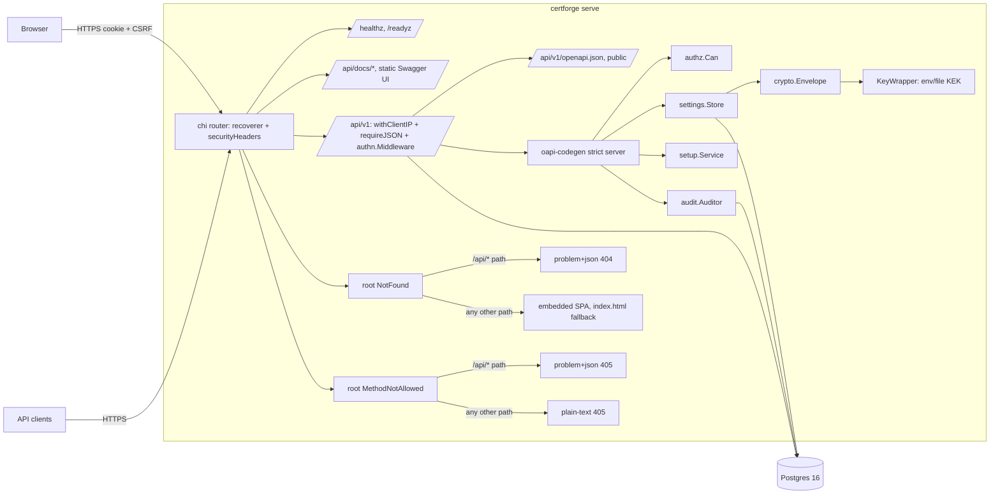
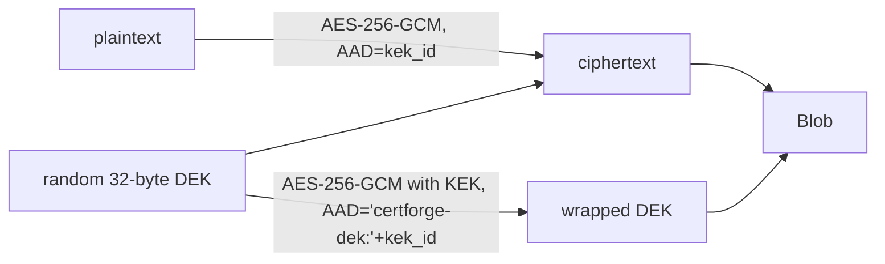

# Architecture

## Components (Phase 1A)

| Package | Role |
|---|---|
| `internal/config` | Reads the only env vars: DB URL, KEK, listeners, base URL, log level |
| `internal/db` | pgx pool, embedded goose migrations (Postgres session-locked, safe to run repeatedly and from several processes), sqlc queries |
| `internal/crypto` | Envelope encryption, `KeyWrapper` |
| `internal/settings` | Settings table: JSON values, sealed secrets, JSON-Schema sections, KEK canary |
| `internal/authn` | argon2id local admin, Postgres sessions, CSRF, `Principal` in context |
| `internal/authz` | Roles → actions, org-scoped bindings, `Can()` |
| `internal/audit` | Append-only, SHA-256 hash-chained events |
| `internal/meta` | Registry of pluggable type schemas for `GET /api/v1/meta/schemas` |
| `internal/setup` | First-run wizard, bootstrap-admin |
| `internal/api` | Router, handlers, problem+json, generated server in `gen/` |
| `internal/webui` | Embedded SPA with index.html fallback (placeholder page unless built with `-tags embedweb`) |

## Startup

1. `config.Load` validates env; a bad KEK length or missing DB URL exits.
2. `db.Open` pings Postgres; `db.Migrate` applies pending migrations under a Postgres session lock.
3. `settings.EnsureCanary` writes the `crypto.canary` secret on first boot, or decrypts it. On failure the server still starts, logs the error, and `/readyz` returns 503.
4. The router is built and serves on `CF_LISTEN_HTTP`. An hourly goroutine purges expired sessions.

## Request path

At the router root, `recoverer` (a local replacement for chi's `middleware.Recoverer`, so a panic becomes a `problem+json` 500 with a logged stack instead of a bare 500) and `securityHeaders` wrap everything, including `/healthz`, `/readyz`, and `/api/docs/*`. Under `/api/v1`: `withClientIP` → `requireJSON` (415 for non-JSON bodies on POST/PUT/PATCH) → `authn.Middleware` (session cookie → `Principal`, CSRF check on mutating methods, 401 unless the route is in `isPublic`) → the oapi-codegen strict handler → `authorize()` (`authz.Can`) → store or service → `audit.Record`.

Root-level `NotFound` and `MethodNotAllowed` handlers both branch on path prefix, but only `NotFound` falls through to the web UI: for a path under `/api/`, `NotFound` returns `problem+json` 404 and `MethodNotAllowed` returns `problem+json` 405; for any other path, `NotFound` falls through to the embedded SPA handler (`webui.Handler()`), which serves `index.html` so client-side routes resolve, while `MethodNotAllowed` returns a plain-text 405 (`http.Error`), not the SPA. Within `/api/v1`, unmatched paths and methods also return `problem+json`. Handler errors of type `*api.HTTPError` become `problem+json`; any other error is logged and then also written as a `problem+json` 500 (`Write(w, 500, "Internal server error", "")`), not a bare 500.

`authn.LoadPrincipal` builds `Principal.Roles`/`Bindings`/`OrgIDs` from `role_bindings`; a binding with a non-NULL `site_id` is skipped entirely until site scope is modelled in Phase 2, so it currently grants nothing. Login (`POST /api/v1/auth/login`) and setup completion (`POST /api/v1/setup/complete`) both build the full principal (via `finishSession`) before `startSession` sets the `cf_session` cookie; if anything after session creation fails, the session row is deleted best-effort so a failed login never leaves a live cookie or session behind.

## Envelope encryption

Blob bytes: `0x01 | len(kek_id) | kek_id | u16 len(wrapped) | wrapped | len(nonce) | nonce | ciphertext`. `kek_id` is `static-` plus 16 hex characters of SHA-256 of the key, so a different KEK is detected before any decryption. `Decrypt` validates every length and never panics on malformed input. Phase 5 adds a Vault Transit `KeyWrapper` and rewrap.

## Data model (Phase 1A)

`orgs`, `sites` (org-scoped), `users` (at most one with `local_password_hash`, enforced by a partial unique index), `sessions` (id = SHA-256 of the cookie token, per-session CSRF), `role_bindings` (subject, role, optional org and site; the `role` check constraint is `admin`, `org-admin`, `operator`, `viewer`, `auditor`), `settings` (key, jsonb value, sealed bytea secret), `audit_events` (append-only via triggers that block UPDATE/DELETE/TRUNCATE, `prev_hash` unique).

## Setup and bootstrap

`setup.Service.Complete` short-circuits (`ErrAlreadyComplete`) as soon as `NeedsSetup` reports false, before hashing a password or taking the advisory lock, then re-checks under the lock so a concurrent completer cannot race past the short-circuit. It validates `baseUrl` twice: `config.ValidateBaseURL` for a well-formed absolute http(s) URL, then against the `general` settings section's JSON Schema (the same schema `PUT /api/v1/settings/general` enforces), so setup never accepts a `baseUrl` a later unchanged `PUT` of that section would reject.

`cmd/certforge bootstrap-admin` reads `CF_ADMIN_PASSWORD` as one-shot CLI input (or `--password-stdin`) to reset or create the local admin and revoke its sessions; it is not server configuration and `serve` never reads that variable.

## Extension points

- New API operation: `api/openapi.yaml` → `make generate` → method on `*api.Server`.
- New settings section: `sections.MustRegister(name, schema, default)` in `cmd/certforge/serve.go`.
- New pluggable type: `metaReg.Add(meta.Kind..., meta.Entry{...})` in `serve.go`.
