# Architecture

CertForge is a Go server with a React web UI, a separate Go agent, and Postgres. This page explains how the pieces fit. It is for contributors and for operators who want to know what runs where. Setup steps live in the guides; this page links to them rather than repeating them.

## Design in brief
| Area | Choice |
|---|---|
| ACME engine | `go-acme/lego` in process, so every lego DNS provider, HTTP-01, TLS-ALPN-01, EAB and any CA work ([ADR 0001](adr/0001-go-lego-in-process.md)). |
| Storage | Postgres only: sqlc, pgx and goose migrations; jobs in River ([ADR 0003](adr/0003-river-jobs.md)); no Redis. |
| Secrets | Envelope encryption: a data key per secret, wrapped by a key (KEK) from an environment variable, a file or Vault Transit ([ADR 0002](adr/0002-envelope-encryption.md)). |
| API | OpenAPI first; the Go server and the TypeScript types are generated from `api/openapi.yaml` ([ADR 0004](adr/0004-openapi-first.md)). |
| Web UI | React, Vite and TypeScript, embedded in the server binary. |
| Agent | A separate small Go binary and container that dials out; clients need no inbound port. |
| Vault | Optional: Transit for the KEK, KV for deploy targets, PKI as a private CA. |
| Scale | One server replica for a small team across several sites, with organizations, sites and roles. |

Everything an operator can change lives in the database and the web UI, not in files. The server reads only what it needs before it can reach the database and decrypt it: `CF_DATABASE_URL`, the encryption key variables, `CF_LISTEN_HTTP`, `CF_LISTEN_AGENT` and `CF_BASE_URL`, and a few others listed in [Configuration](../reference/configuration.md). Every pluggable type (DNS provider, deploy target, notifier, signer) publishes a JSON Schema, and the UI draws its form from that schema, so a new provider needs no UI change.

## Components
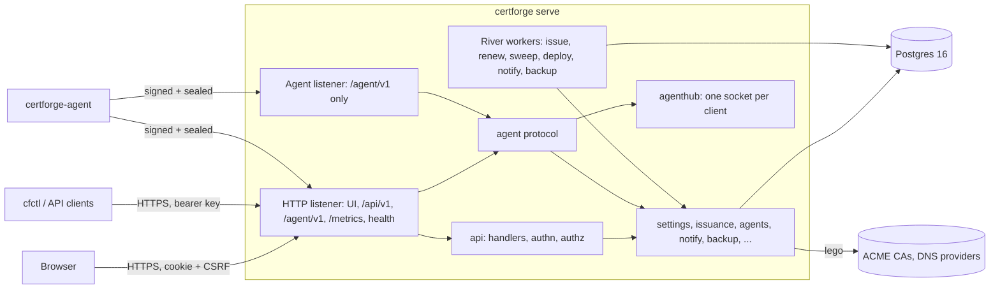

| Package | Role |
|---|---|
| `cmd/certforge`, `cmd/certforge-agent`, `cmd/cfctl` | The server (`serve`, `migrate`, `bootstrap-admin`, `backup`, `restore`, `healthcheck`, `version`), the agent and the CLI. |
| `internal/config` | Bootstrap environment variables. |
| `internal/db` | pgx pool, embedded goose migrations (run under a database lock, safe from several processes), sqlc queries. |
| `internal/crypto`, `internal/kek` | Envelope encryption and `KeyWrapper`; encryption key status and re-encryption. |
| `internal/settings` | Settings table: JSON values, sealed secrets, JSON Schema sections, the key canary. |
| `internal/authn`, `internal/authz` | Local admin, OIDC, sessions, CSRF, API keys; roles, bindings and `Can()`. |
| `internal/audit` | Append-only, hash-chained audit events. |
| `internal/api` | Router, handlers, problem+json, generated server in `gen/`, the agent protocol endpoints. |
| `internal/meta`, `internal/setup`, `internal/webui` | Type schema registry; first-run wizard; embedded SPA. |
| `internal/issuance`, `internal/signer`, `internal/challenge`, `internal/certstore` | Orders, renewals and attempts; ACME, built-in CA and Vault PKI signers; challenge routing and DNS providers; certificate version storage. |
| `internal/render`, `internal/importer` | Output formats (PEM parts, DER, PKCS#12, JKS); acme.sh and certbot import. |
| `internal/agents`, `internal/agentca`, `internal/agenthub`, `internal/agentproto`, `internal/agent` | Server-side agent service (enrolment, grants, reports); agent CA, listener and responder certificates; the WebSocket registry; the wire protocol shared by both sides; the agent itself. |
| `internal/delivery`, `internal/deploy`, `internal/targets` | Layouts and Traefik rendering; server-run deploy; the shared deploy target model. |
| `internal/notify`, `internal/monitor`, `internal/metrics`, `internal/backup`, `internal/vault`, `internal/flow` | Notifiers and events; external monitors; Prometheus; backup and restore; Vault client; the Flow view. |

## Startup
1. `config.Load` validates the environment. A bad key or a missing database URL exits.
2. `db.Open` pings Postgres and `db.Migrate` applies pending migrations under a database lock. `serve` also holds a shared advisory lock for its whole life.
3. The root secret is unsealed, then the `crypto.canary` setting is checked or created. A wrong key fails the root step and stops the server. A failed canary leaves the server running with `/readyz` at `503`.
4. The router and the River workers start. The HTTP listener serves on `CF_LISTEN_HTTP`.
5. The agent CA is ensured and the listener certificate issued. If that works, the agent listener serves on `CF_LISTEN_AGENT`; if it fails, the log says so and only the HTTP port serves agents.

## Request path

At the router root, `recoverer` (a local replacement for chi's `middleware.Recoverer`, so a panic becomes a `problem+json` 500 with a logged stack instead of a bare 500) and `securityHeaders` wrap everything, including `/healthz`, `/readyz`, and `/api/docs/*`. Under `/api/v1`: `withClientIP` → `requireJSON` (415 for non-JSON bodies on POST/PUT/PATCH) → `authn.Middleware` (session cookie → `Principal`, CSRF check on mutating methods, 401 unless the route is in `isPublic`) → the oapi-codegen strict handler → `authorize()` (`authz.Can`) → store or service → `audit.Record`.

Root-level `NotFound` and `MethodNotAllowed` handlers both branch on path prefix, but only `NotFound` falls through to the web UI: for a path under `/api/`, `NotFound` returns `problem+json` 404 and `MethodNotAllowed` returns `problem+json` 405; for any other path, `NotFound` falls through to the embedded SPA handler (`webui.Handler()`), which serves `index.html` so client-side routes resolve, while `MethodNotAllowed` returns a plain-text 405 (`http.Error`), not the SPA. Within `/api/v1`, unmatched paths and methods also return `problem+json`. Handler errors of type `*api.HTTPError` become `problem+json`; any other error is logged and then also written as a `problem+json` 500 (`Write(w, 500, "Internal server error", "")`), not a bare 500.

`authn.LoadPrincipal` builds `Principal.Roles`/`Bindings`/`OrgIDs` from `role_bindings`; a binding with a non-NULL `site_id` is skipped entirely, because site scope is not modelled, so it grants nothing. Login (`POST /api/v1/auth/login`) and setup completion (`POST /api/v1/setup/complete`) both build the full principal (via `finishSession`) before `startSession` sets the `cf_session` cookie; if anything after session creation fails, the session row is deleted best-effort so a failed login never leaves a live cookie or session behind.

## Envelope encryption

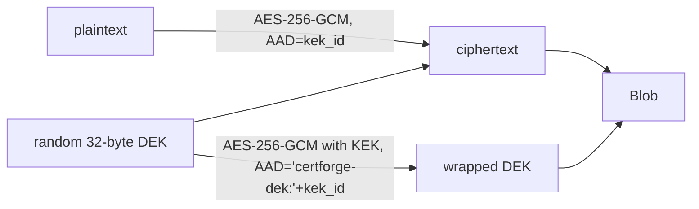

Blob bytes: `0x01 | len(kek_id) | kek_id | u16 len(wrapped) | wrapped | len(nonce) | nonce | ciphertext`. `kek_id` (`crypto.KeyID`) is `static-` plus 16 hex characters of a domain-separated hash, `SHA-256("certforge-kek-id:" || key)`, not a plain SHA-256 of the key, so a different KEK is detected before any decryption. `Decrypt` validates every length and never panics on malformed input. A Vault Transit `KeyWrapper` (`crypto.TransitWrapper`, `kek_id` = `vault-` plus 16 hex characters derived from the Vault address, mount and key name — stable across a Transit key-version bump inside Vault).

### Multi-wrapper envelope and KEK rotation (ADR 0014)

`crypto.Envelope` holds one active `KeyWrapper` plus zero or more previous ones (`CF_KEK_PREVIOUS[_FILE]`, `CF_KEK_PREVIOUS_VAULT_*`). `Encrypt` always uses the active wrapper; `Decrypt` picks whichever wrapper's id matches the blob's own `kek_id` header, so a row sealed under a previous KEK keeps decrypting for as long as that KEK stays configured — no downtime, no offline migration, while `internal/kek.RewrapWorker` moves rows onto the active KEK in the background.

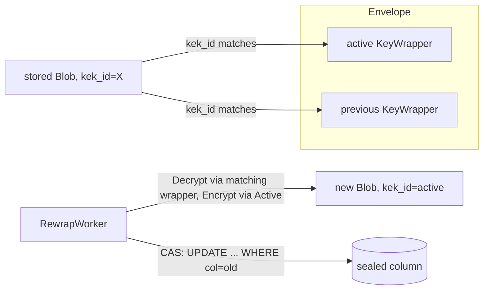

A previous→active rewrap always decrypts and re-encrypts the whole value through the Envelope (fresh DEK, nonce and ciphertext), never just re-wraps the DEK in place: `Encrypt`'s AEAD binds `kek_id` as additional data, so relabelling it onto old ciphertext would break authentication on the next read. The one exception is a same-id Transit key-version bump on the active KEK (`TransitWrapper.Rewrap`, the `crypto.Rewrapper` interface), which moves the wrapped DEK alone without the DEK ever leaving Vault. Every rewrap write is `UPDATE ... SET col = $new WHERE pk = $pk AND col = $old` — a lost compare-and-swap counts the row in `remaining` for the next run rather than overwriting data the job never decrypted. See [Key management](../operations/key-management.md) for the operator runbook.

## Data model
Migrations are in `internal/db/migrations` (goose, never edited once applied). The tables, by area:

| Area | Tables |
|---|---|
| Tenancy and access | `orgs`, `sites`, `users`, `sessions`, `role_bindings`, `api_keys` |
| Configuration | `settings` (key, JSON value, sealed secret) |
| Audit | `audit_events` (append-only through triggers; `prev_hash` is unique) |
| Issuance | `cas`, `acme_accounts`, `dns_provider_credentials`, `issuance_defaults`, `certificates`, `certificate_versions`, `issuance_attempts`, `manual_dns_pending`, `ca_crls`, `rate_ledger` |
| Agents and delivery | `agent_cas`, `clients`, `enrollment_tokens`, `enrollment_requests`, `output_specs`, `deploy_targets`, `hooks`, `client_cert_grants`, `deployments`, `hook_runs`, `server_deployments` |
| Alerts | `notification_channels`, `notification_events`, `notification_deliveries`, `external_monitors` |

Secrets are sealed columns (private keys, ACME account keys, EAB HMAC keys, DNS credential secrets, channel and target secrets). Each blob carries its key id. A certificate stores its canonical material as leaf DER, chain DER and a PKCS#8 key; renderers turn that into files on demand. A certificate's settings are nullable overrides of `issuance_defaults`, where null means inherit.

## Setup and bootstrap

`setup.Service.Complete` short-circuits (`ErrAlreadyComplete`) as soon as `NeedsSetup` reports false, before hashing a password or taking the advisory lock, then re-checks under the lock so a concurrent completer cannot race past the short-circuit. It validates `baseUrl` twice: `config.ValidateBaseURL` for a well-formed absolute http(s) URL, then against the `general` settings section's JSON Schema (the same schema `PUT /api/v1/settings/general` enforces), so setup never accepts a `baseUrl` a later unchanged `PUT` of that section would reject.

`cmd/certforge bootstrap-admin` reads `CF_ADMIN_PASSWORD` as one-shot CLI input (or `--password-stdin`) to reset (after setup) the local admin's password and revoke its sessions; it is not server configuration and `serve` never reads that variable.

## Extension points

- New API operation: `api/openapi.yaml` → `make generate` → method on `*api.Server`.
- New settings section: `sections.MustRegister(name, schema, default)` in `cmd/certforge/serve.go`.
- New pluggable type: `metaReg.Add(meta.Kind..., meta.Entry{...})` in `serve.go`.

## Routing challenge provider

`challenge.Router` is built per attempt from the certificate's verification rules followed by the inherited catch-all rules (certificate overrides, then org, then global defaults). See [ADR 0005](adr/0005-routing-challenge-provider.md).

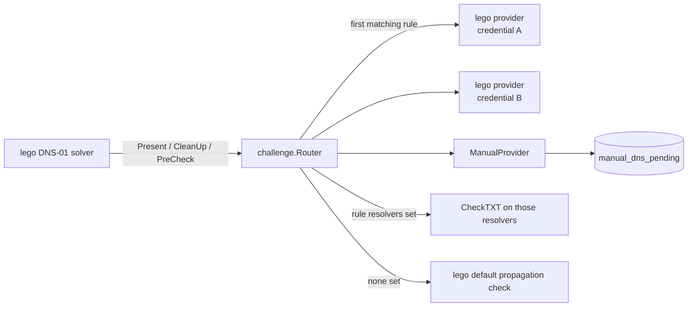

A mixed-method certificate (its names resolve to more than one challenge type) does not register with lego's `SolverManager` at all:

```mermaid
flowchart LR
  O[mixedResolver.Solve] -->|per authorization: TypeFor + FindChallenge| Pick[pickChallenge]
  Pick -->|dns-01| RD[Router.For&#40;dns-01&#41;]
  Pick -->|http-01| RH[Router.For&#40;http-01&#41;]
  Pick -->|tls-alpn-01| RT[Router.For&#40;tls-alpn-01&#41;]
  RD --> DC[dns01.NewChallenge]
  RH --> HC[http01.NewChallenge]
  RT --> TC[tlsalpn01.NewChallenge]
  DC & HC & TC -->|validate: hand-rolled poll| CA[(ACME CA)]
```

- Match patterns: `*`, `*.zone` (one label below zone, or `*.zone` itself), `zone` (zone and everything below). First match wins. The UI's coverage panel uses the same rules.
- `Router.Validate` rejects uncovered names and IP addresses before an order exists. `ruleFor` — the single choke point every name-to-rule lookup goes through — skips an http-01/tls-alpn-01 rule for a wildcard name and tries the next matching rule in order (no ACME CA offers those challenges for a wildcard authorization), so such a name is "uncovered" only once every rule in its path has been skipped this way.
- lego providers are built by `challenge.Build` under a global mutex with an isolated environment (`internal/challenge/lego_env.go`).
- Provider schemas are generated from lego's TOML metadata by `tools/gen-lego-schemas` into `internal/challenge/schemas/` and published to the meta registry by `challenge.AddToMeta` and served under `dnsProviders` in `GET /api/v1/meta/schemas`.

### Type-aware routing

A rule's challenge type comes from its provider's `Type()` (manual-dns counts as dns-01, since both use the TXT record). `Router.For(t)` returns a view scoped to one type: its `Present`/`CleanUp`/`PreCheck` resolve a lego callback's bare authorization domain to the rule of type `t` that covers it (`routeForType`), rather than to whichever rule the domain would otherwise resolve to. This matters because lego's `SolverManager.chooseSolver` picks a registered solver per authorization by a fixed type preference, never by domain — with two providers registered (say dns-01 and http-01) every authorization of an order would otherwise reach the same one, regardless of which rule actually names it. `acme.Signer.Issue` registers exactly one type's view (`solver.For(type)`) as the matching lego provider (`SetDNS01Provider`, `SetHTTP01Provider`, `SetTLSALPN01Provider`) when `req.Challenge.ChallengeTypes()` names only one type. A certificate whose rules span more than one type goes through `issueMixed` instead (`internal/signer/acme/orderflow.go`, [ADR 0012](adr/0012-mixed-method-order-flow.md)): it builds the ACME core directly with the exported `api.New` (`lego.Client`'s own core is unexported) and drives `certificate.NewCertifier` with a `mixedResolver` that resolves each authorization's type from `solver.TypeFor` and its own `solver.For(t)` view, so one order can mix dns-01, http-01 and tls-alpn-01 across a certificate's names.

http-01 rules with `via: server` (the default) are served by this process itself: `challenge.HTTPTokens` holds each pending token's key authorization in memory (10-minute TTL) for `GET /.well-known/acme-challenge/{token}` on the main listener (see [API](../reference/api.md)) to answer. `via: agent` and every tls-alpn-01 rule are served by a client over its agent connection: `agents.Service` implements `challenge.AgentRelay` (`issueWorker.Relay`, wired in `cmd/certforge/serve.go`) and relays `Present`/`CleanUp` through it (`challenge_present`/`challenge_cleanup`), waiting up to `agents.DefaultChallengeReadyTimeout` (30s) for the client's `challenge_ready`. A client that is offline or reports no matching capability fails the attempt with "client `<name>` is offline or cannot serve challenges"; one that never answers in time fails with "client `<name>` did not confirm the challenge within 30s".

## Issuance flow

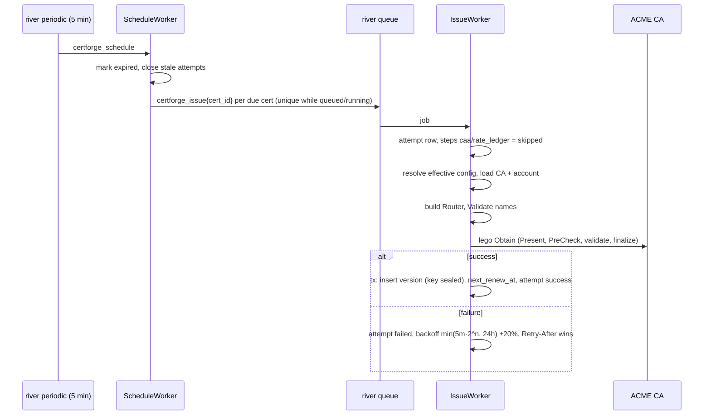

- `POST /certificates` and `POST /certificates/{id}/renew` enqueue the same job directly.
- Attempt steps: `caa`, `rate_ledger`, `account`, `order`, `challenge <name>` (one per name; `waiting_manual` while an operator must act), `finalize`, `store`.
- ACME and challenge failures are recorded and scheduled through `certificates.next_renew_at`; the job itself succeeds. Only database errors make river retry the job.
- `next_renew_at` after success: `days` mode is `notAfter − N days`, `percent` mode is `notAfter − N% of lifetime`, never earlier than half the lifetime. ARI (`useAri`) can pull a renewal earlier.
- A failed renewal keeps a still-valid certificate `active`; the periodic scan marks certificates `expired` when the current version's `notAfter` passes.

## Grants and revisions

```mermaid
flowchart LR
  V[IssueWorker commits a version] -->|OnVersion| R[agents.render]
  G[Grant, layout, target or hook change] --> R
  R -->|same tx| D[(deployments.expected, state pending)]
  R -->|same tx| B[(clients.desired_revision + 1)]
  B -->|after commit, push grants| S[hub: sync{revision}]
```

A grant is a client × certificate assignment with a layout and/or a deploy target, a run-ordered list of hooks and a delivery mode (`push` or `pull`); `deployments.expected` holds the digests the server rendered for the grant's certificate's current version, and `deployments.installed`/`state` hold what the agent last reported. Every grant create, update, redeploy or delete, every layout, deploy target or hook change, and every new certificate version re-renders the affected grants' `deployments.expected` and bumps `clients.desired_revision` inside the same transaction as the change; a `sync{revision}` nudge is sent over the hub after commit, but only to clients that have a push grant among the changed ones — pull grants wait for the agent's own pull schedule, so a change touching only pull grants never nudges.

A new certificate version is rendered by `agents.Service.OnVersion` (the `issuance.VersionListener`) in its own transaction after the issuance commit, not the issuance transaction itself; a failed or lost `OnVersion` (for example the process stopping between commit and the listener call) is caught by an hourly river job, `SweepDeployments`, that re-renders every live grant whose deployment is behind its certificate's current version. Both re-render one client per transaction, so a render failure for one client (a corrupted deploy target config, say) is logged and does not block or roll back any other client's update. `render` always locks every affected client `FOR UPDATE` before it writes a deployment row, in every caller, so a grant write (which already holds its one client's lock) and a resync (layout/target/hook change, a new version, the sweep, or a certificate rename) can never take the two locks in opposite orders. Renaming a certificate re-renders and path-checks its live grants in the same transaction as the rename, since a Traefik target's paths depend on `SafeName(certificate name)`.

Two grants on one client may never write the same path — including a Traefik target's generated `certs/<SafeName>/*` files, so two certificates whose names share a `SafeName` collide — checked across the client's live grants and any still awaiting removal (their last-rendered `expected` paths count, falling back to their layout/target definition when nothing was ever rendered); a conflicting create, update, layout/target update or certificate rename returns 409. Deleting a grant of a client that has ever actually applied a revision marks it `removed_at` and bumps the revision so the agent can delete its files on its own schedule; the row is only deleted once the agent's next report confirms the files are gone. A grant of a client that is revoked, or is pending and has never applied any revision (no agent ever could have written its files), has no agent to act on it, so the delete removes the row at once — including a client that re-enrolled after deploying, which keeps the soft-delete path since files from before the re-enrolment may still be on disk. Deleting a certificate locks it and counts its live and removal-pending grants (not just live ones, since `cert_id` cascades) in one transaction; creating a grant locks the certificate in a compatible-but-exclusive mode, so the two can never race each other into a dangling grant.

### Server-side deploy {#server-side-deploy}

A server-run deploy target (`vault-kv`; `internal/deploy.RunsOn`) has no agent, so its grants ("server grants": `client_cert_grants.client_id NULL`, `deploy_target_id` set) never enter the flow above — `agents.render`, `OnVersion` and `SweepDeployments` all exclude them (`client_id IS NOT NULL`), and a grant's `Grant.runsOn`/`Grant.serverDeployment` in place of `deployment` tells the two kinds apart in the API. `internal/deploy.Dispatcher` is their own, parallel `issuance.VersionListener`, registered in `cmd/certforge/serve.go` alongside `agents.Service`:

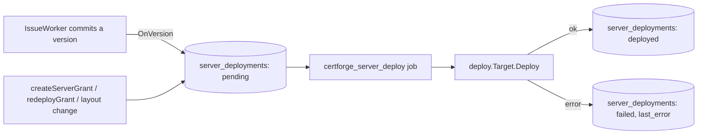

`Dispatcher.OnVersion` upserts every live server grant of the certificate to `pending` and enqueues `certforge_server_deploy{grantId, versionId}` (unique per grant while queued or running, so a burst of versions never stacks duplicate jobs; retried up to 5 times with backoff on failure). `createServerGrant`, `redeployGrant` and a server grant's own `updateGrant` (layout change) call the same upsert-and-enqueue (`Dispatcher.EnqueueTx`) from their own transaction, so the grant write and the first deploy attempt commit together. `DeployWorker` renders the certificate's own material — a layout's files (PEM parts only; a server grant's layout may never hold a p12/jks/DER file) or, without one, the four canonical PEM parts (the key only when the target's `includeKey` is set) — and hands them to the target's own `Deploy`. A failure records a truncated (≤ 1000 characters) `last_error`; every `internal/vault.Client` error a `Target` implementation returns is already redacted of any token or secretId before `Dispatcher` ever sees it, so `last_error` is safe to show as-is. Deleting a server grant removes its row (and, by cascade, its `server_deployments` row) at once — there is no agent to wait on, so there is no removal-pending state the way a client grant has.

### Deploy targets {#deploy-targets}

`internal/targets` is the shared, database-free model every deploy target type will implement, one `Registry` keyed by type code in place of the separate `internal/deploy`/`internal/delivery` switches above (a later task moves `vault-kv` and Traefik onto it). Each type declares a `Mode` — `server`, `agent`, or `either`, when the operator chooses at create time (`ResolveSide`) — telling a grant whether it needs a client or runs server-side the way `vault-kv` does today, and a `KeyPolicy` (`never`/`optional`/`always`) telling the API whether it needs the certificate's private key. A `FileTarget` (Traefik's file-provider target, and any future one) renders the files an agent writes rather than making a live call of its own; an optional `Reloader` signals a service reload afterward. A type's config schema marks its write-only fields `"secret": true`; `Registry.Parse` merges a request's secret fields against the ones already stored for it — an omitted field or the `__unchanged__` sentinel keeps the stored value (and is reported back, so a caller can skip re-encrypting it), an explicit `""` clears it — before handing the fully resolved config to the type's own `Parse`, which enforces which of its secrets are actually required; `Split`/`Merge` move a config's secret fields out of and back into its public JSON. `Redact` scrubs a target's own secrets — raw, URL-escaped and base64 forms — out of any error before it can reach `last_error`, a `deploy.failed` event or a log line. `internal/targets/targetstest` provides test-only types (`Secret`, `File`) that exercise this shape without a product registry ever seeing them.

## Agent protocol
This is the canonical description of the protocol between `certforge-agent` and the server. The threat model and the reasons are in [ADR 0020](adr/0020-agent-protocol-through-proxy.md); the operator view is in [Security model](../operations/security-model.md#agent-channel) and [Agents](../guide/agents.md).

The routes are a small `net/http` surface under `/agent/v1`, separate from the OpenAPI-documented `/api/v1`. They are served on the agent listener (`CF_LISTEN_AGENT`, TLS with a server certificate and no client certificate) and also on the HTTP listener, so an agent can sit behind a proxy that terminates TLS. TLS is hygiene only. Everything that matters is signed and sealed above it, so a proxy that sees plaintext can drop or delay messages but cannot read, forge, replay or enrol.

### Building blocks
- **Identity keys.** Each agent has an ECDSA P-256 key and a certificate from the internal agent CA (URI SAN `urn:certforge:client:<uuid>`). The server never presents a TLS identity the agent relies on; instead it signs responses with a **responder certificate** from the same CA: 24 hours, renewed at two thirds of its life, extended key usage `OCSPSigning` and subject OU `2.25.284011506363329835389774668932300182646`. The agent requires exactly that and checks it against its trust bundle.
- **Signed messages.** A subset of HTTP Message Signatures (RFC 9421). A request covers `@method`, `@authority`, `@request-target`, `content-digest` and `cf-ephemeral`, with parameters `created`, `nonce`, `keyid` and `alg`. A response covers `@status` and `content-digest`, with `created`, `req-nonce` (the request's nonce) and `keyid`, plus `cf-error` when present. Signatures are raw 64-byte `r||s`. The verifier rebuilds the `Signature-Input` and requires an exact match. `@authority` comes from configuration (the **Agent URL** host, and on the HTTP port the `CF_BASE_URL` host), never from the request's `Host`.
- **Sessions.** `POST /agent/v1/session` carries the agent certificate (`Cf-Agent-Cert`) and an ephemeral P-256 key (`Cf-Ephemeral`) in a signed request. The reply holds the server's ephemeral key and a session id, signed by the responder (`Cf-Signer-Cert` carries the responder certificate). Both sides derive per-direction AES-256-GCM keys with HKDF-SHA256 (salt = session nonce, info = `certforge-agent-session-v1` plus the direction). GCM nonces are a counter, and the additional data binds direction, sequence and request context. Ephemeral keys give forward secrecy.
- **Sealed REST.** Inside a session, each request names the session in `Cf-Ephemeral`, the sequence in `Cf-Seq`, and carries a sealed body. The server verifies the signature with the session's key, checks the nonce against its cache, re-checks the client (active, newest certificate serial) on every request, and opens the body in a sliding window of 64 sequence numbers. Responses, including errors, are sealed and signed with the request's nonce.
- **Limits.** Clock skew 60 s (server), 120 s (shared maximum). Nonce TTL 120 s. Sessions last 600 s, 16 per client (oldest evicted), 1000 messages per direction. A WebSocket message is at most 8 MiB. Sessions, nonces and enrolment hellos live in process memory, which is why there is one replica.

### Refusals
Before a request signature verifies, the server cannot tell an agent from a probe, so it answers with an unsigned bodyless response and a `Cf-Error` code (`session`, `auth`, `stale`, `replay`, `seal`, `body`, `size`). The agent treats it as a transport error, never as revocation. After the signature verifies, refusals are signed and the code is covered by the signature. Only a signed `auth` refusal, or a sealed `revoked` message on the socket, makes the agent stop. The one unsigned code the agent acts on is `session`: it opens a new session once.

### Endpoints
| Route | Notes |
|---|---|
| `GET /enroll/hello?nonce=N` | One-use server ephemeral key (2 minutes, at most 4096 held), the CA chain, signed by the responder. Rate limited per address. |
| `POST /enroll` | HPKE-sealed enrolment request; see below. Rate limited per address. |
| `POST /enroll/{id}` | Poll an enrolment; signed with the CSR key. |
| `POST /session` | Opens a session. |
| `GET /ws` | Signed upgrade; sealed frames. |
| `POST /renew` | New certificate for an authenticated agent. Resets the session. |
| `GET /assignments` | The client's grants and pending removals, keyed to `desired_revision`. |
| `GET /grants/{id}/bundle` | One grant's rendered files and key material for agent-side targets; audited as `grant.bundle_fetched`. |
| `POST /report` | Deployment results, hook runs and removal confirmations for a revision. |
| `POST /heartbeat` | Installed-file digests, checked for drift. |

Every route except the `/enroll*` group, `/session` and `/ws` requires a session. Handshake routes are limited to 600 requests a minute per address (burst 120).

### Enrolment
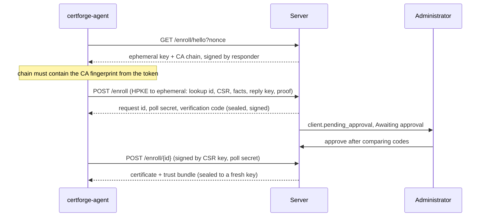
- The token format is `cf1.<base64url(server url)>.<CA sha256 hex>.<secret>`. The token is never sent. The lookup id is `sha256("cf-enrol-id" || tokenHash)`. The proof is an HMAC keyed by the token hash over the CSR digest, host, created time, nonce and reply key, so a replaced CSR or reply key fails.
- The token is consumed only after the proof verifies. A spent token with the same CSR key while the request is pending or approved is idempotent: it gets a new poll secret and no second notification. Any other key is refused.
- The verification code is the first eight base32 characters of `sha256(CSR public key DER || CA fingerprint)`, shown as `ABCD-EFGH`. The agent recomputes it with the pinned fingerprint and aborts on a mismatch.
- With **Require approval** on (default), the request is pending until approved. Pending requests expire after the approval window (default 24 h); at most 50 can be pending per organization. With it off, the request is created approved. The first poll after approval signs the certificate, activates the client and returns the certificate; later polls return the same one until the window closes.
- The poll secret travels in the signed, unsealed poll body. A proxy that reads it still cannot poll without the CSR key.
- Audit actions: `client.enrol_requested`, `client.enrol_approved`, `client.enrol_rejected`, `client.enrolled`.

### Push and pull
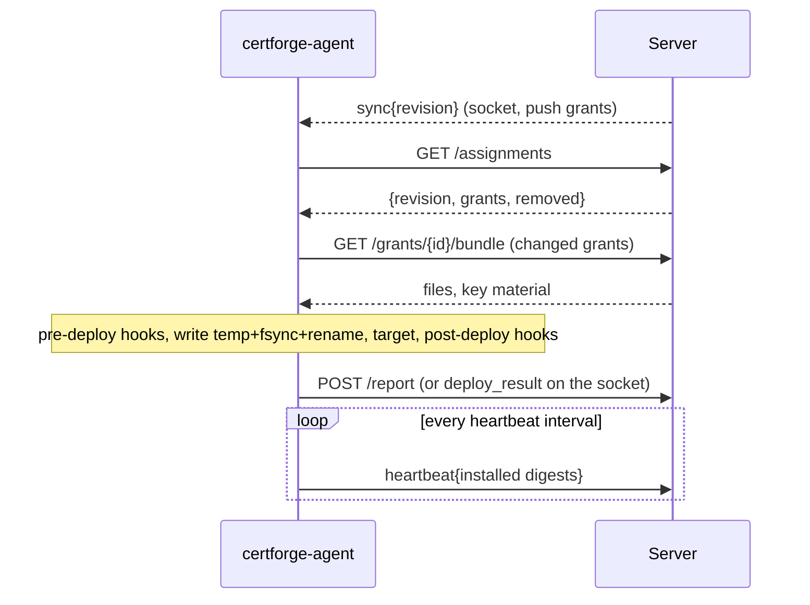
Sync is level-triggered: every change bumps `clients.desired_revision` in its own transaction, and `sync` is only a nudge sent after commit. The agent reconciles to the latest revision on connect, on `sync` and on its pull schedule, so a missed nudge only delays it.

`GET /assignments` returns `{revision, grants: [{id, certificateId, certificateName, versionId, fingerprint, delivery, files: [{path, owner, group, mode, sha256}], target: {type, config}|null, hooks: [...]}], removed: [{id, files, target}]}`. A grant appears in `grants` once its certificate has an issued version. A grant marked `removed_at` appears in `removed` with the paths it last wrote. Only a result with `state: ok` and no `versionId`, in a report at or past the revision that first listed the grant as removed, deletes the row. A report built from older assignments therefore never confirms a removal it did not see.

`POST /report` carries `{revision, results: [{grantId, versionId, state, installed, error, hookRuns}]}`. A result for a grant the client does not hold is ignored. A result whose `versionId` is not the deployment's current one changes no state, but its hook runs are still recorded. `clients.applied_revision` only advances and never exceeds `desired_revision`. `Report` and `Heartbeat` lock the client row before its deployment rows, the same order every grant-writing path uses.

### Drift
A deployment is `pending` until the first report, then `ok`, `drift` or `failed` from comparing `deployments.expected` with what the agent installed, from a report or a heartbeat. A heartbeat only re-checks deployments already `ok` or `drift`. Each state change is audited once, as `deployment.ok`, `deployment.failed` or `deployment.drift`. A grant with `auto_remediate` bumps `desired_revision` the moment its deployment turns `drift`, so the agent redeploys on its own.

### Socket
`internal/agenthub` keeps one WebSocket per client ([ADR 0010](adr/0010-agent-websocket-hub.md)). The newest connection evicts the old one. The server pings every 25 s and closes a socket after 75 s without a message or pong. The registry is in memory, so `Client.connected` means connected to this process.
1. The agent sends a signed upgrade (`Cf-Agent-Cert`, `Cf-Ephemeral`). The server verifies it and the client.
2. The server's first frame, `hello_ack`, is the only one in the clear. It carries the responder's signature over both ephemeral keys, the session id and the upgrade nonce.
3. Every later frame is binary `seq(8) || AES-GCM`, accepted strictly in order. A wrong type, short frame, bad tag, gap or replay ends the connection, and the agent reconnects with backoff.
4. Messages are sealed JSON with a `type` field. Server to agent: `welcome` (reply to `hello`, with the heartbeat interval and desired revision), `sync{revision}`, `trust_bundle_update`, `revoked`, `challenge_present{token, keyAuth, domain, method, webroot?}`, `challenge_cleanup{token}`. Agent to server: `hello`, `heartbeat`, `deploy_result` (a report) and `challenge_ready{token, error?}`. They reach the same service methods as the REST routes; `challenge_ready` has no REST equivalent.
5. `sync` is only a hint. `revoked` and `trust_bundle_update` count only after they are opened. A trust update is applied only if every CA verifies against the current pool; otherwise the agent waits for the next signed renewal to bring the bundle.
6. Close codes: `4000` replaced by a newer connection, `4001` revoked or re-enrolled, `4002` idle, `4003` the session is near its 1000-message cap and the agent should reconnect for fresh keys. A close code alone is never trusted: `4001` without a sealed `revoked` message just reconnects.

### Agent CA, trust and rotation
CertForge runs its own ECDSA P-256 agent CA (`agent_cas`) and trusts several at once, so rotation never strands an agent ([ADR 0009](adr/0009-agent-mtls-and-ca.md)). The listener and responder certificates are signed by the oldest non-retired CA. Rotation makes a new CA active for new agent certificates; connected agents receive the bundle, renew and reconnect, and others pick it up at their next renewal. A CA can be retired only when no active agent certificate depends on it. Steps: [Key management](../operations/key-management.md#agent-ca-rotation).

## Event fan-out and notifications

Every event source shares one `*notify.Emitter` and one `*notify.Registry`, both constructed once in `cmd/certforge/serve.go` and handed to `notify.Service` (channel CRUD, `testChannel`, `listEvents`), `notify.Sources` (`cert.issued`/`cert.renewal_failed` synchronously, the rest hourly), `monitor.Service` and `backup.Service`:

```mermaid
flowchart LR
  subgraph Sources
    IW[IssueWorker.Listeners] -->|OnVersion: cert.issued| NS[notify.Sources]
    IW -->|OnFailure: cert.renewal_failed| NS
    Scan[certforge_notify_scan, hourly] -->|expiring/expired, deploy, offline, agent-cert, prune| NS
    Mon[monitor.Service.Check] -->|state transition| MonEv[monitor.mismatch/unreachable/expiring/recovered]
    Bak[backup.Service.RunScheduled] -->|backup.completed/failed| BakEv[backup event]
    API[testChannel] -->|test| TestEv[test event]
  end
  NS --> E[Emitter.Emit]
  MonEv --> E
  BakEv --> E
  TestEv --> E
  E -->|exact-once by DedupeKey, tx| Events[(notification_events)]
  E -->|FOR KEY SHARE, per matching enabled channel| Deliv[(notification_deliveries: pending)]
  E -->|InsertTx| Job[certforge_notify_deliver]
  Job --> DW[DeliverWorker]
  DW -->|Registry.Get&#40;channel.type&#41;| N[Notifier.Send]
  N -->|webhook/discord/ntfy/homeassistant| HX[httpx.Client: no redirects, SSRF-checked]
  N -->|smtp| Mail[mail.SendMail]
  DW -->|redacted last_error| Deliv
```

`Emit` locks the event's matching channels `FOR KEY SHARE` and writes the event plus one `notification_deliveries` row per match inside one transaction (a nil `tx` argument opens its own), so a delivery job is only ever enqueued for a channel the same commit already recorded as pending — there is no window where a job exists with no row to update. `DedupeKey` (its exact per-kind shape is in [Events](../reference/events.md#dedupe)) makes `Emit` a no-op for a condition already recorded; `notify.Sources.Scan` (the hourly `certforge_notify_scan` job) also prunes `notification_events` older than `notify.EventRetention` (90 days) in the same run, since the dedupe key itself only exists for as long as its row does.

`DeliverWorker` looks the channel's notifier up in the shared `Registry` by `type`, decrypts the channel's sealed secrets, and calls `Notifier.Send`; a failure's error is passed through `httpx.Redact` against every secret value before it is ever written to `last_error` ([Security model](../operations/security-model.md#notification-channel-secrets-and-url-policy)). `monitor.Service` and `backup.Service` hold the same `*notify.Emitter` pointer `notify.Sources` does — set once, after `riverClient` exists (`notifyEmitter.River = riverClient`), since `Emitter.River` is only needed at `Emit` time, never at `RegisterRiver` time.

## Backup and restore

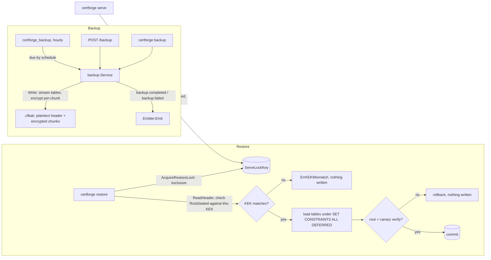

The stream key (`DeriveKey(DeriveKey(root, "certforge-backup"), hex(salt))`) and the archive format itself are [Security model](../operations/security-model.md#backup-encryption) and [Backup](../guide/backup.md); this diagram is the wiring only. `serve.go` derives `backupBaseKey` once at boot, before `clear(root)`, and passes it to `backup.Service` alongside the KEK id(s) that `Write` seals `RootSealed` with on each run — `Write` itself re-reads the live `crypto.root` row inside its own snapshot transaction, so a backup taken after a KEK rewrap never uses a stale key. `AcquireServeLock`/`AcquireRestoreLock` share one advisory lock key (`backup.ServeLockKey`): any number of `serve` processes hold it shared for their whole lifetime, a `restore` needs it exclusively, so a running server always blocks a restore and a restore in progress blocks a server from starting ([Security model](../operations/security-model.md#serve-lock-and-restore)).

## Authentication principals
| Principal | Mechanism |
|---|---|
| Human | OIDC authorization code with PKCE, or the local break-glass admin. A server-side session in Postgres, an `HttpOnly` `SameSite=Lax` cookie and a CSRF token. Group claims map to role bindings. |
| Machine | `Authorization: Bearer cf_<prefix>_<secret>` with scopes, an optional organization and an expiry. |
| Agent | Signed requests inside a sealed session on `/agent/v1`, on either port. A client certificate alone admits nothing. |

Details and the reasons: [Security model](../operations/security-model.md), [ADR 0006](adr/0006-oidc-sessions.md), [ADR 0007](adr/0007-rbac-bindings-and-api-keys.md).

## Known constraints
- **One replica.** The agent hub, agent sessions, request nonces and the in-memory HTTP-01 token store are per process. More replicas need a fan-out (Postgres `LISTEN/NOTIFY`) and shared stores.
- **lego reads provider credentials from environment variables.** Providers are built under a global mutex with an isolated environment (`internal/challenge/lego_env.go`). The lego version is pinned.
- **Half-open WebSockets behind NAT.** Ping every 25 s with a read deadline, jittered reconnect, and a new connection evicts the old one.
- **A lost encryption key loses all secrets.** Every blob carries its key id, a canary is decrypted at start, and backups carry a reminder to keep a copy of the key.
- **A compromised server can push code to every agent.** Hooks are off by default and allowlisted by the agent operator, run as argv without a shell.
- **Shorter certificate lifetimes.** Renewal defaults to a percentage of lifetime plus ARI, not a fixed 30 days.
- **Many DNS providers with secrets.** Secret fields are write-only with an `__unchanged__` sentinel.

## See also
- [Development](development.md), [ADR index](adr/), [Operations: security model](../operations/security-model.md)
